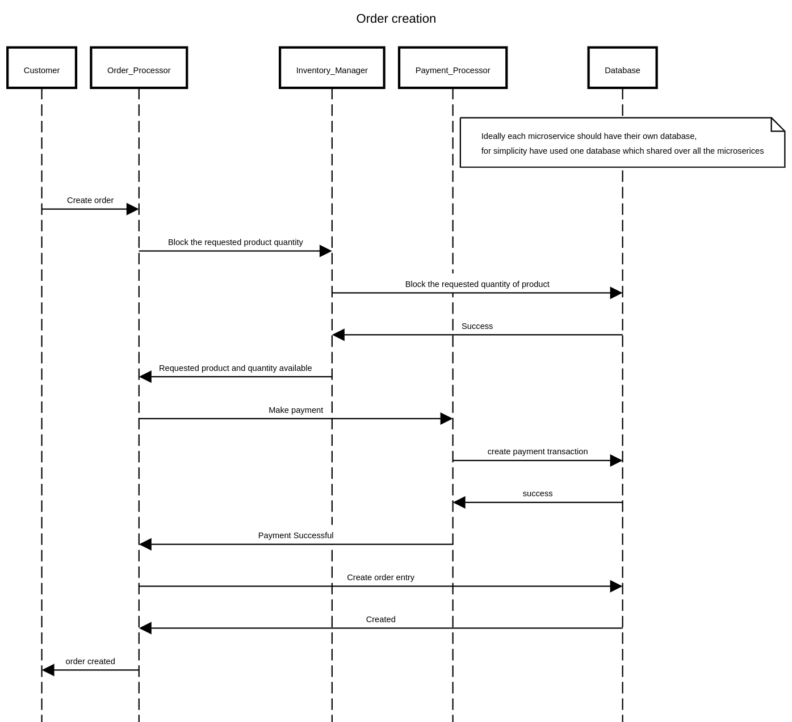

# Sellerapp Assignment

## Notes

  1. Unit tests avoided due to lack of time.
  2. Single database used for all the microservice, ideally this should be separate.
  
## Prerequisites:

    1. docker compose
    2. make
    3. curl

## Order creation sequence diagram



## How to run

```bash
cd sellerapp    //root folder
make deploy
make logs       //to view logs
```

### Create a new product

```bash
curl -X 'POST' \
  'http://localhost:5001/v1/inventory' \
  -H 'accept: */*' \
  -H 'Content-Type: application/json' \
  -d '{
  "name": "test product",
  "price": 10,
  "quantity": 20
}'
```

#### view the created product

```bash
curl -X 'GET' \
  'http://localhost:5001/v1/inventory/1' \
  -H 'accept: application/json'
```

### To create an order

```bash
curl -X 'POST' \
  'http://localhost:5000/v1/order' \
  -H 'accept: */*' \
  -H 'Content-Type: application/json' \
  -d '{
  "total_amount": 10,
  "product_id": 1,
  "product_quantity": 1
}'
```

after creating the order, we can check associated payment and inventory details updated in the database

#### get order

```bash
curl -X 'GET' \
  'http://localhost:5000/v1/order/1' \
  -H 'accept: application/json'
```

sample response: (notedown the productid and transaction id for getting the relevant details)

```json
{"id":1,"transaction_id":1,"created_at":"2023-01-19T15:04:38.173913Z","total_amount":10,"product_id":1,"product_quantity":1}
```

#### Check product count is **decreased**: (from initial 20 - order product quantity 1 = 19)

```bash
curl -X 'GET' \
  'http://localhost:5001/v1/inventory/1' \
  -H 'accept: application/json'
```

#### Check payment is created with order amount **10**

```bash
curl -X 'GET' \
  'http://localhost:5002/v1/payment/1' \
  -H 'accept: application/json'
```


### Cancel an order

```bash
curl -X 'DELETE' \
  'http://localhost:5000/v1/order/1' \
  -H 'accept: */*'
```

after cancelling the order we can check associated, product and payment state

#### Get order

```bash
curl -X 'GET' \
  'http://localhost:5000/v1/order/1' \
  -H 'accept: application/json'
```

sample response: (notedown the productid and transaction id for getting the relevant details) and also order status changed to **cancelled**

```json
{"id":1,"transaction_id":1,"status":"cancelled","created_at":"2023-01-20T06:31:42.62857Z","total_amount":10,"product_id":1,"product_quantity":1}
```

#### Check product count is **increased**: (previous 19 + order product quantity 1 = 20)

```bash
curl -X 'GET' \
  'http://localhost:5001/v1/inventory/1' \
  -H 'accept: application/json'
```

#### Check payment status is **refunded**

```bash
curl -X 'GET' \
  'http://localhost:5002/v1/payment/1' \
  -H 'accept: application/json'
```
